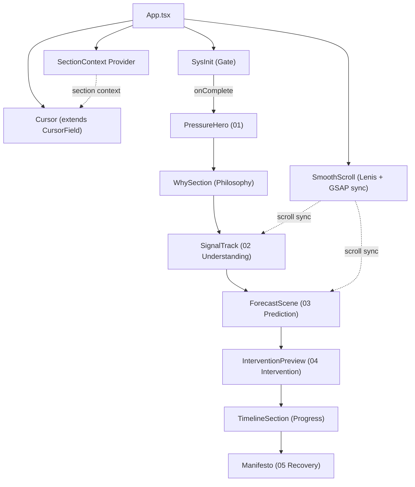

# AEGIS — Complete Design, Motion & Product Analysis

> *"The Intelligence Between Intention and Action."*
> Vibe2Ship 2026 · Solo Developer · Google AI Integration

---

## 0. Executive Summary

This document is a full creative-technical dissection of the AEGIS project. It synthesizes principles extracted from seven reference systems against the existing codebase, producing a concrete design language, motion language, interaction system, and build plan that **extends** the current architecture — never replaces it.

**The core thesis:** AEGIS must make users feel *observed*, *understood*, *guided*, and *protected* — **before** they feel productive. Every design decision below serves that emotional sequencing.

### What Exists Today (Preserved)

| Layer | Files | Status |
|-------|-------|--------|
| Particle cursor system | [CursorField.tsx](file:///d:/WebProjects/AEGIS/src/components/CursorField.tsx) | ✅ Operational — 45 particles, mouse attraction/repulsion, triangle mesh, idle drift |
| Hero | [HeroSection.tsx](file:///d:/WebProjects/AEGIS/src/components/HeroSection.tsx), [StatusIndicator.tsx](file:///d:/WebProjects/AEGIS/src/components/StatusIndicator.tsx), [AnimatedLine.tsx](file:///d:/WebProjects/AEGIS/src/components/AnimatedLine.tsx) | ✅ Operational — breathing title, blur-reveal entrance, status badge |
| Philosophy cards | [WhySection.tsx](file:///d:/WebProjects/AEGIS/src/components/WhySection.tsx) | ✅ Operational — Observe/Adapt/Protect glass cards with staggered reveal |
| Timeline | [TimelineSection.tsx](file:///d:/WebProjects/AEGIS/src/components/TimelineSection.tsx) | ✅ Operational — 5-step vertical timeline with status states |
| Close | [FinalSection.tsx](file:///d:/WebProjects/AEGIS/src/components/FinalSection.tsx) | ✅ Operational — Build/Adapt/Awaken manifesto + metadata |
| Hooks | [useSmoothScroll.ts](file:///d:/WebProjects/AEGIS/src/hooks/useSmoothScroll.ts), [useMousePosition.ts](file:///d:/WebProjects/AEGIS/src/hooks/useMousePosition.ts), [useScrollReveal.ts](file:///d:/WebProjects/AEGIS/src/hooks/useScrollReveal.ts) | ✅ Operational — Lenis, lerped mouse, FM variants |
| Design tokens | [index.css](file:///d:/WebProjects/AEGIS/src/styles/index.css) | ✅ Operational — TW4 `@theme`, void/signal palette, animations |
| Stack | React 19, TypeScript, Vite, TW4, GSAP, Framer Motion, Lenis | ✅ Installed |

> [!IMPORTANT]
> **Every component above is the foundation.** Nothing in this analysis recommends deletion or replacement. The plan is *elevation and extension*.

---

## 1. Design DNA

*Patterns that appeared independently across 5+ of the 7 references — treated as structural, not coincidental.*

### 1.1 Darkness as Default, Not as Theme

Six of seven references default to near-black (`#080808`–`#0f0f0f`), never pure `#000000`. Pure black reads as "off." Near-black with a faint temperature reads as "a room with the lights down" — depth, not absence.

**AEGIS alignment:** Current `--color-void: #050505` is correct in intent but slightly too pure. The canonical recommendation shifts to `#0A0B0D` — a near-black with a faint cool cast that signals *precision*, not mood. This is a single token change, not a redesign.

### 1.2 One Accent, Used Sparingly

Every reference has exactly one accent color and uses it almost exclusively for interactive or attention-bearing elements — never for large fills. The accent is a *pointer*, not a paint job.

**AEGIS alignment:** Current `--color-signal: #7fdbca` is the accent. It's already used correctly in `StatusIndicator`, `TimelineSection`, and glass-card titles. The extension: signal should evolve into a **temperature gradient** across the page scroll (see §9 AEGIS Visual System).

### 1.3 The Bracketed/Mono "System Label" Device

Small monospace text in brackets or all-caps tracking reads instantly as "machine speaking." Present explicitly in reference 07 (`[ SEC_001 // THE ESTABLISHING SHOT ]`) and implicitly in reference 02's Roboto Mono body copy.

**AEGIS alignment:** `StatusIndicator` already uses `font-mono tracking-[0.25em] uppercase`. This convention should extend to **every section** as a numbered index label: `[ 01 // PRESSURE ]`, `[ 02 // SIGNAL ]`, etc. Cost: near-zero. Emotional impact: disproportionately high.

### 1.4 Index Numerals as Structural Device

Numbering sections explicitly reinforces "this is a sequence with a beginning and an end" — critical for AEGIS's five-beat emotional arc.

**AEGIS alignment:** Currently absent. Add `01`–`05` section indices in the System register to every stage.

### 1.5 Everything is Masked, Nothing Just Appears

`overflow:hidden` + inner-element translate is the near-universal reveal primitive across all references. Content is *revealed from behind a wipe*, not faded into existence.

**AEGIS alignment:** Current reveals use Framer Motion's `opacity + y + blur` pattern (via `revealVariants`). This is *close* but missing the mask discipline. The upgrade path: introduce GSAP `SplitText` with `mask: true` for headline reveals, keeping FM's blur-dissolve for body content. Two reveal tiers, not one.

### 1.6 The Cursor is Never Just a Pointer

All four references with custom cursors treat the cursor as a *status indicator*, not a click target — its size, color, or state communicates something about what's beneath it.

**AEGIS alignment:** `CursorField` is already an interactive canvas system. It currently has one mode (seafoam particles everywhere). The extension: the cursor should communicate AEGIS's read of the current section's **emotional register** via subtle color-temperature shifts (warm in Pressure, cool in Recovery).

---

## 2. Motion DNA

*Concrete, numeric patterns extracted from reference code — treated as tunable constants, not vibes.*

### 2.1 One Ease, Everywhere, Per "Mode"

Landing Reveal registers a single `CustomEase('hop')` and uses it for every beat. The Components reference registers one `cinematicEase` globally. The lesson: **pick 1–2 named eases for the whole product and never improvise a third.**

**AEGIS will define exactly two:**

| Ease | Curve | Use |
|------|-------|-----|
| `aegis-resolve` | `cubic-bezier(0.16, 1, 0.3, 1)` | Anything settling into clarity — hero arrival, Recovery reveals, magnetic settle |
| `aegis-pressure` | `cubic-bezier(0.65, 0, 0.35, 1)` | Pressure beat only — chaos elements snap, don't glide |

> [!WARNING]
> A third, improvised easing curve appearing anywhere in the codebase is the single fastest way to make a cinematic build feel like a webpage again. Two named eases, enforced by convention, or it doesn't ship.

**Current gap:** [useScrollReveal.ts](file:///d:/WebProjects/AEGIS/src/hooks/useScrollReveal.ts) uses `ease: [0.25, 0.1, 0.25, 1]` inline. This should be replaced by a reference to the named `aegis-resolve` constant.

### 2.2 Scrub and Lerp Constants are House Values

Parallax reference reuses `scrub: 1.9` identically across six unrelated sections. The Components reference uses `lerp: 0.05` globally. A reused damping constant makes unrelated sections feel like the same physical material.

| Parameter | AEGIS Default | Source | Notes |
|-----------|--------------|--------|-------|
| Scroll-bound scrub | `1.4` | Parallax's `1.9`, tightened | One constant, reused everywhere |
| Global smooth-scroll lerp | `0.08` | Components' Lenis `0.05`, loosened | Too low reads sluggish on a product site |
| Magnetic pull radius | `16px`, rotate: `0` | Obys `max:18, rotate:4` | Rotation = playful; disabled for AEGIS |
| Reveal stagger (char/word) | `0.025s` | Landing Reveal `0.025` | Above ~0.04s headlines feel slow |
| Section-reveal delay ladder | `+0.1s` per sibling | Furrow `0.3→0.6s` | Cap at 4 staggered siblings |

**Current gap:** [useSmoothScroll.ts](file:///d:/WebProjects/AEGIS/src/hooks/useSmoothScroll.ts) uses `duration: 1.2` which is fine, but Lenis is running its own RAF loop disconnected from GSAP's ticker. These must sync via `lenis.on('scroll', ScrollTrigger.update)` once GSAP ScrollTrigger is introduced.

### 2.3 Negative-Offset Overlap, Not Sequential Waiting

Nearly every multi-beat timeline uses GSAP's relative position syntax (`'-=1'`, `'-=0.8'`) to start the next beat *before* the previous one finishes. Sequences that wait for full completion between beats read as slideshows; overlapping ones read as one continuous gesture.

### 2.4 Distinct Entrance vs. Exit Grammar

Landing Reveal's hero arrives on `power4.out`, deliberately different from the `hop` ease used for the loader departure. AEGIS should exploit this: **Pressure-stage motion should feel different in kind from Recovery-stage motion**, not just be the same curve played in two places.

### 2.5 Settling Logic That Terminates

Obys's magnetic effect explicitly stops its RAF loop once displacement is below epsilon. Motion systems in AEGIS must follow this discipline everywhere — no RAF loops running forever in the background.

**Current gap:** [CursorField.tsx](file:///d:/WebProjects/AEGIS/src/components/CursorField.tsx) runs its RAF loop unconditionally. Consider adding a visibility-based pause (when the tab is hidden or mobile) and epsilon-settling for the magnetic sub-system once introduced.

---

## 3. Typography DNA

### Three Registers, Not Two

The strongest references separate type into at least three functional roles:

| Register | Role | AEGIS Face | Treatment |
|----------|------|-----------|-----------|
| **Display** | The 2–3 words per section that *are* the statement | Cormorant Garamond (already loaded) | `clamp(3.5rem, 10vw, 9rem)`, tight tracking (`-0.02em` to `-0.04em`), masked-reveal only |
| **System** | Status labels, counters, the "AEGIS is speaking" voice | Monospace (currently `SF Mono / Fira Code`) | Uppercase, wide tracking (`0.2–0.3em`), small size, bracketed labels |
| **Editorial** | Actual sentences a human reads | Inter (already loaded) | Relaxed leading (`1.6–1.75`), italicize the *consequence* clause |

**Current alignment:** The two-font system (Cormorant + Inter) is already loaded in [index.html](file:///d:/WebProjects/AEGIS/index.html). The `--font-mono` token exists in [index.css](file:///d:/WebProjects/AEGIS/src/styles/index.css). All three registers are *available* — they just need to be used with the discipline above.

### Typography Rules

- **Massive display type is structural, not decorative.** Hero headline at `clamp(3rem, 8vw, 10rem)` is already close. Can push to `10vw` floor for more impact.
- **Uppercase + negative tracking for density headlines, generous tracking for system labels.** Tight type feels urgent; loose tracked type feels calm and systemic.
- **Italics as the "this is a feeling, not a fact" marker.** E.g.: *"AEGIS noticed your calendar density doubled — and flagged it before you had to ask."*
- **Line-height compressed for display (`70–105%`), relaxed for body (`1.6–1.75`).** The contrast itself communicates hierarchy.

---

## 4. Emotional DNA

### The Five-Beat Arc

AEGIS's emotional journey maps directly to the user experience:

```
Pressure → Understanding → Prediction → Intervention → Recovery
```

Each beat must feel **different in kind**, not just different in content:

| Stage | Required Feeling | Visual Carrier | Motion Carrier | Copy Register |
|-------|-----------------|----------------|----------------|---------------|
| **01 PRESSURE** | *Observed* | Warm-register cursor; dense, overlapping notification-shaped noise | `aegis-pressure` ease (sharp, anxious snap); scratch-reveal canvas — visitor's own cursor clears the noise | 2nd person, present tense, specific and slightly uncomfortable |
| **02 UNDERSTANDING** | *Understood* | Pinned horizontal signal-track — discrete cards (calendar density, message backlog, tone shift) | `scrub`-bound horizontal traversal, no snap — "being walked through" | Diagnostic, calm, naming specifics back |
| **03 PREDICTION** | *Guided* | Pinned/snapped timeline visualization — a forecasted collision point before it happens | First appearance of cool/resolution accent as a single highlighted point | Future-conditional, confident, specific |
| **04 INTERVENTION** | *Protected* | Hover-to-preview action cards, magnetic CTAs | Direct manipulation — visitor hovers to see AEGIS act | Declarative, low-drama — the system already decided |
| **05 RECOVERY** | *Productive* | Word-grid close, fully resolved to cool register, generous whitespace | Held, centered, near-static — contrast with preceding is the entire point | Short. The shortest copy on the page. Relieved, not instrumented |

> [!IMPORTANT]
> **The throughline: AEGIS never opens with what it can do. It opens with what it noticed.** Every reference earns emotional impact in the first two seconds, before any feature is stated.

### Mapping to Existing Components

| Existing Component | Current Role | Extended Role |
|--------------------|-------------|---------------|
| `HeroSection` | Static "Awaiting" title | → Evolves into `<PressureHero>` with scene-cycling |
| `WhySection` | Observe/Adapt/Protect cards | → Preserved as philosophy anchor, gains section index |
| `TimelineSection` | Hackathon progress tracker | → Preserved, gains GSAP-driven progressive reveal |
| `FinalSection` | Build/Adapt/Awaken close | → Evolves into `<Manifesto>` with word-grid hover isolation |
| `CursorField` | Background particle system | → Gains section-aware color temperature shifting |

---

## 5. Interaction Philosophy

### 5.1 Cursor-as-Status-Indicator

Extract the *pattern* (cursor communicates state), not any single implementation. AEGIS's cursor should communicate the current section's emotional register via subtle color-temperature shift — warm in Pressure, neutral in Understanding, cool in Recovery.

**Implementation:** Add a `SectionContext` provider that broadcasts the current active section. `CursorField` reads this and shifts its `SIGNAL_COLOR` between warm and cool endpoints.

### 5.2 Magnetic Elements for Primary Actions Only

Never apply magnetism to body text links. It's a "this matters, lean toward it" signal — it loses meaning if everywhere.

**Apply to:** Main CTA buttons, the SYS.INIT gate interaction, primary navigation. **Never:** body links, card titles, footer items.

### 5.3 Hover Reveals a Preview, Not Just a State Change

Hovering an AEGIS task/signal should preview what AEGIS would *do* about it — not just highlight it.

### 5.4 Direct-Manipulation Reveal

The user's own motion causes the reveal, rather than time or scroll. This is rare across the reference set and disproportionately powerful when present.

**AEGIS application:** The Pressure stage hero should use a canvas `destination-out` technique where the visitor's cursor motion *erases* notification noise to reveal the AEGIS message beneath.

### 5.5 Scroll-Direction Awareness

UI chrome should react to *which way* the user is moving, not just *how far*. The scroll-down indicator in HeroSection should fade out the instant the user scrolls past a threshold.

---

## 6. Component Architecture

### 6.1 React Component Map

| Section (AEGIS Stage) | Component | Core Technique | Difficulty | New/Existing |
|-----------------------|-----------|---------------|------------|--------------|
| Gate | `<SysInit>` | Counter-tween + masked lines + session-gated | Low-Med | **NEW** |
| 01 Pressure (hero) | `<PressureHero>` | Scene-cycling headline, chars converging, scratch-reveal canvas | Med-High | **EXTENDS** HeroSection |
| 02 Understanding | `<SignalTrack>` | Pinned horizontal scroll of "what AEGIS reads" cards | Medium | **NEW** |
| 03 Prediction | `<ForecastScene>` | Pinned/snapped scroll-scrubbed timeline visualization | Medium | **NEW** |
| 04 Intervention | `<InterventionPreview>` | Hover-to-preview action cards, magnetic CTAs | Low-Med | **NEW** |
| 05 Recovery | `<Manifesto>` | Word-grid, group-hover isolate, calm centered close | Low | **EXTENDS** FinalSection |
| Philosophy | `<WhySection>` | Glass cards with staggered reveal | Low | **PRESERVED** |
| Progress | `<TimelineSection>` | Vertical timeline with status states | Low | **PRESERVED** |
| Global | `<Cursor>` | Dual-layer RAF cursor, section-context-driven color | Low-Med | **EXTENDS** CursorField |
| Global | `<Magnetic>` | Self-terminating RAF lerp, rotate disabled | Low | **NEW** |
| Global | `<Reveal>` | IntersectionObserver + CSS-owned motion, delay-ladder | Low | **NEW** |
| Global | `<SmoothScroll>` | Lenis root wrapper, synced to GSAP ScrollTrigger | Low | **EXTENDS** useSmoothScroll |
| Global | `<PinnedScene>` | Reusable `ScrollTrigger.create({pin, scrub, snap})` wrapper | Low-Med | **NEW** |
| Global | `<SectionIndex>` | Mono `[ 0X // LABEL ]` tag per section | Low | **NEW** |

### 6.2 Folder Architecture

```
src/
├── components/
│   ├── Global/
│   │   ├── Cursor.tsx              ← extends CursorField
│   │   ├── Magnetic.tsx            ← new
│   │   ├── Reveal.tsx              ← new
│   │   ├── SmoothScroll.tsx        ← extends useSmoothScroll
│   │   ├── PinnedScene.tsx         ← new
│   │   └── SectionIndex.tsx        ← new
│   ├── Gate/
│   │   └── SysInit.tsx             ← new
│   ├── Hero/
│   │   ├── PressureHero.tsx        ← extends HeroSection
│   │   ├── StatusIndicator.tsx     ← preserved
│   │   └── AnimatedLine.tsx        ← preserved
│   ├── Signal/
│   │   └── SignalTrack.tsx         ← new
│   ├── Forecast/
│   │   └── ForecastScene.tsx       ← new
│   ├── Intervention/
│   │   └── InterventionPreview.tsx ← new
│   ├── Philosophy/
│   │   └── WhySection.tsx          ← preserved
│   ├── Progress/
│   │   └── TimelineSection.tsx     ← preserved
│   └── Recovery/
│       └── Manifesto.tsx           ← extends FinalSection
├── hooks/
│   ├── useMousePosition.ts         ← preserved
│   ├── useScrollReveal.ts          ← preserved (FM variants)
│   ├── useSmoothScroll.ts          ← extended (GSAP sync)
│   └── useSectionContext.ts        ← new (scroll-position → active section)
├── utils/
│   └── gsap.ts                     ← new (plugin registration + named eases)
├── styles/
│   └── index.css                   ← extended
├── App.tsx                          ← extended
└── main.tsx                         ← preserved
```

---

## 7. Animation Rules

### Global Constants (Non-Negotiable)

| Rule | Value | Enforcement |
|------|-------|-------------|
| Minimum animation duration | `≥ 0.8s` | All FM `duration`, all GSAP `duration` |
| No bounce/elastic eases | `aegis-resolve` or `aegis-pressure` only | Named constants, never inline bezier |
| Every reveal: opacity + y + blur | `0→1`, `30-50px→0`, `blur(6-10px)→blur(0px)` | `revealVariants` for FM, `SplitText mask:true` for GSAP |
| Breathing feel | Hero title: slow scale pulse; status dot: pulse; pending items: pulse | CSS `@keyframes`, never JS-driven |
| Maximum 2 easing curves | `aegis-resolve`, `aegis-pressure` | Convention-enforced |
| Stagger cap | 4 siblings max before switching to computed stagger | Prevents slow cascades |

### GSAP vs. Framer Motion Boundary

> [!IMPORTANT]
> This is a **hard rule**, not a preference:

| If it's bound to... | Use... | Reason |
|---------------------|--------|--------|
| **Scroll position** | GSAP + ScrollTrigger | Continuous, scrub-driven, timeline-choreographed |
| **Component state** (hover, mount, toggle) | Framer Motion | Discrete, spring-physics, React render cycle |

Never let both libraries animate the same `transform` on the same element. This is the most common bug class in mixed-library builds.

---

## 8. Scroll Rules

### One Global Smoothing Layer, Many Local Scrub Layers

- **Lenis** = the global smoothing (already in place via `useSmoothScroll`)
- **GSAP ScrollTrigger** = per-section scrub/pin behaviors (to be added)
- **Sync point:** `lenis.on('scroll', ScrollTrigger.update)` + drive Lenis RAF through `gsap.ticker`

### Pin Rules

| When to Pin | When to Scrub Without Pinning |
|-------------|-------------------------------|
| A "scene" must be *held* (Pressure hero, Prediction forecast) | Content should move at a different rate than the viewport (ambient parallax, background layers) |
| Horizontal-on-vertical-input traversal (SignalTrack) | Simple fade-in-on-view reveals (WhySection, TimelineSection) |

### Critical Implementation Detail

Every pinned or horizontal section **must** have `invalidateOnRefresh: true`. Without it, resizing the window (or a font finishing its load) permanently breaks the pinned distance.

### IntersectionObserver vs. ScrollTrigger

- Use one grouped `IntersectionObserver` for **binary** states (visible/not-visible reveal toggles) — this is already what Framer Motion's `whileInView` does
- Reserve per-element `ScrollTrigger` for **continuous** scroll-bound values (`scrub`)

---

## 9. AEGIS Visual System

### Color: A Temperature Gradient, Not a Palette

Every reference picks one accent and holds it constant. AEGIS should do something none of them do: **let color temperature itself perform the emotional arc.**

```
┌─────────────────────────────────────────────────────────┐
│  PRESSURE (warm)        →        RECOVERY (cool)        │
│                                                          │
│  amber/desaturated red   neutral    cool cyan/blue       │
│  ● ─────────────────────── ● ──────────────────── ●     │
│  #D4A574                              #7FDBCA           │
│  (alarm, urgency)         (clarity, resolution)          │
└─────────────────────────────────────────────────────────┘
```

| Token | Value | Purpose |
|-------|-------|---------|
| `--color-void` | `#0A0B0D` | Primary background (faint cool cast) |
| `--color-ash` | `#0E0F11` | Card/section backgrounds |
| `--color-signal` | `#7FDBCA` | Resolution/cool accent (preserved) |
| `--color-signal-dim` | `#5FB8A5` | Muted resolution accent (preserved) |
| `--color-pressure` | `#D4A574` | Warm/alarm accent (Pressure beat only) |
| `--color-pressure-dim` | `#A67C52` | Muted warm accent |
| `--color-text-primary` | `#EDEDEF` | Off-white ink (never pure white) |
| `--color-text-secondary` | `#6B6B6B` | Secondary copy |
| `--color-text-tertiary` | `#3A3A3A` | Tertiary/dimmed |

### Motifs

1. **Index numerals on every stage** — `01 PRESSURE / 02 UNDERSTANDING / 03 PREDICTION / 04 INTERVENTION / 05 RECOVERY` in System register, present in every section corner
2. **Gate typography survives into persistent UI** — the SYS.INIT sequence ends with a fragment of its own counter text contracting into the persistent header mark
3. **Cursor as the one continuously-present "AEGIS is here" signal** — carrying the temperature-gradient logic at every point in scroll

---

## 10. GSAP Strategy

### Plugin Registration (Once, Globally)

Create [src/utils/gsap.ts](file:///d:/WebProjects/AEGIS/src/utils/gsap.ts):

```typescript
import gsap from 'gsap';
import { CustomEase } from 'gsap/CustomEase';
import { SplitText } from 'gsap/SplitText';
import { ScrollTrigger } from 'gsap/ScrollTrigger';
import { useGSAP } from '@gsap/react';

gsap.registerPlugin(CustomEase, SplitText, ScrollTrigger);

// Named eases — the ONLY two allowed in the entire project
CustomEase.create('aegis-resolve', '0.16, 1, 0.3, 1');
CustomEase.create('aegis-pressure', '0.65, 0, 0.35, 1');

export { gsap, CustomEase, SplitText, ScrollTrigger, useGSAP };
```

### Rules

- Import GSAP only from `utils/gsap.ts` — never directly from `'gsap'`
- Use `useGSAP()` hook in every component instead of manual `useEffect` + `tl.kill()`
- `SplitText` with `mask: true` is the default for every headline reveal
- Sync Lenis to ScrollTrigger: `lenis.on('scroll', ScrollTrigger.update)`

> [!NOTE]
> As of the April 2025 Webflow acquisition, the entire GSAP toolset (including SplitText, CustomEase, ScrollSmoother, Observer) is free for commercial use. No Club GreenSock membership required.

---

## 11. Framer Motion Strategy

Framer Motion owns **discrete, state-driven, physically-simulated micro-interactions** that live inside React's render cycle:

- Cursor hover-state transitions
- Card hover/tilt states
- `AnimatePresence`-driven mount/unmount (modals, toasts)
- The existing `revealVariants` / `staggerContainer` / `viewportConfig` system in `useScrollReveal.ts`

### Default Spring

```typescript
{ type: 'spring', stiffness: 150, damping: 15, mass: 0.1 }
```

This is the tuned default from the Components reference — reasonable starting point for AEGIS.

### What FM Does NOT Own

- Anything bound to scroll position → GSAP
- Multi-beat choreography → GSAP timelines
- `SplitText`-based headline reveals → GSAP
- Pinned/scrubbed sections → GSAP

---

## 12. AI Experience Strategy

### The "Intelligence" Layer

AEGIS isn't a chatbot. It's an intelligence that manifests through the interface itself:

1. **Signal Detection** — AEGIS reads patterns (calendar density, message backlog, task clustering, tone shifts) without requiring the user to report them
2. **Predictive Intervention** — AEGIS forecasts collision points before they happen and acts preemptively
3. **Ambient Presence** — The cursor, status labels, and color temperature all communicate "AEGIS is watching" without requiring a dedicated UI panel

### Google AI Integration Points

| Feature | Integration | Component |
|---------|-------------|-----------|
| Natural language understanding of user state | Gemini API | `<SignalTrack>` — parsing user context into signal cards |
| Predictive scheduling analysis | Gemini API | `<ForecastScene>` — forecasting collision points |
| Intervention recommendation | Gemini API | `<InterventionPreview>` — generating action previews |
| Emotional tone analysis | Gemini API | `<Cursor>` — informing the warm/cool temperature shift |

### The "System Speaking" Convention

Every AI-generated insight should be displayed in the **System register** (mono, uppercase, tracked, bracketed), never in the Editorial register. This creates the feeling of an intelligence *reporting*, not a chatbot *conversing*.

```
[ SYS.AEGIS // SIGNAL DETECTED ]
Calendar density doubled in the last 72 hours.
Two high-priority threads collide at 14:40.

Recommended: defer the 15:00 review to Thursday.
```

---

## 13. Components To Avoid

| What | Why | Reference |
|------|-----|-----------|
| Mandatory click-to-enter gate | Friction before value — contradicts a product about *reducing* friction | Samurai 02 |
| Three.js fabric shader image-follow | Signals "agency craft," wrong register for calm intelligence | Obys 01 |
| Pixel-sampling cursor logic | Real per-frame perf cost; AEGIS has section context for free | Furrow 03 |
| `luxy.js` dependency | Unmaintained since ~2018; Lenis replaces it | Parallax 04 |
| Horizontal-scroll-only on touch/mobile | Usability trap; must collapse to vertical stack below 768px | Components 07 |
| Decorative-only motion | Anything that animates *because it can* rather than carrying narrative | Parallax/Gameland |
| A third easing curve | Destroys cinematic consistency instantly | All references |
| Empty placeholder files | `NoiseOverlay.tsx` / `utils/animations.ts` anti-pattern | Components 07 |

---

## 14. Build Order

Build in this sequence — each phase de-risks the next. **Not page order.**

### Phase 1: Global Plumbing *(Day 1)*

- [ ] `utils/gsap.ts` — plugin registration + named eases
- [ ] Extend `useSmoothScroll` — sync Lenis to GSAP ticker + ScrollTrigger
- [ ] `useSectionContext` hook — scroll-position → active section broadcast
- [ ] `<SectionIndex>` component — mono bracketed labels
- [ ] Extend `index.css` — add pressure-register tokens, refine void/ash values
- [ ] `<Reveal>` component — IntersectionObserver + CSS-owned motion

> [!TIP]
> None of this is visible as a "feature," but every later section depends on it existing correctly. This is exactly the layer where reference engineering smells originated.

### Phase 2: Gate + Hero *(Day 1–2)*

- [ ] `<SysInit>` — counter-tween + masked manifesto lines + session gate
- [ ] Extend `HeroSection` → `<PressureHero>` — scene-cycling masked headline
- [ ] Scratch-reveal canvas interaction (Pressure beat)
- [ ] Section-aware cursor color shifting

> [!IMPORTANT]
> Build and test this in isolation. If the first 10 seconds don't land, no amount of polish downstream recovers it.

### Phase 3: Middle Stages *(Day 2–3, parallelizable)*

- [ ] `<SignalTrack>` — pinned horizontal scroll of signal cards
- [ ] `<ForecastScene>` — pinned/snapped timeline visualization
- [ ] `<InterventionPreview>` — hover-to-preview action cards + magnetic CTAs
- [ ] `<Magnetic>` component (used by Intervention CTAs)

### Phase 4: Recovery + Polish *(Day 3–4)*

- [ ] Extend `FinalSection` → `<Manifesto>` — word-grid with group-hover isolation
- [ ] Mobile responsive collapse (horizontal → vertical, cursor disable on touch)
- [ ] `prefers-reduced-motion` fallback on all animated components
- [ ] Performance profiling on mid-tier hardware
- [ ] Final page assembly in `App.tsx`

---

## 15. Performance Budget

| Concern | Risk | Mitigation |
|---------|------|------------|
| Scratch-reveal canvas + RAF cursor + GSAP timelines simultaneously during Pressure beat | Frame budget pressure on mid-tier | Profile this combination early, not at the end |
| If tight: cursor ring is first to simplify | Drop rotation, keep lerp | Scratch-reveal carries more narrative weight |
| Canvas on mobile | Touch devices don't benefit from cursor tracking | Don't initialize cursor system on `pointer: coarse` |
| ScrollTrigger leaks | Each pinned section creates a persistent listener | Use `useGSAP()` for automatic cleanup on unmount |
| Font loading reflow | Late-loading Google Fonts break pinned distances | `invalidateOnRefresh: true` on every pinned/horizontal section |

---

## 16. Accessibility & Reduced Motion

> [!IMPORTANT]
> Every animated reference in the set is silent on `prefers-reduced-motion` except Obys's magnetic effect. AEGIS must do better.

- `prefers-reduced-motion` branch: keep every *state change* (reveals happen, sections progress) but remove every *physically-simulated* motion
- Scratch-reveal: provide a non-motion fallback — it cannot be the *only* path to hero content
- Masked reveals → simple opacity fades
- No magnetic pull, no cursor ring rotation
- All section content must be reachable without animation completion

---

## 17. Mobile Strategy

Three things in this document do **not** survive touch input unmodified:

1. **Pinned horizontal scroll** (`<SignalTrack>`) → collapse to vertical stacking below ~768px
2. **Magnetic cursor-pull** → don't initialize (not degrade — just don't run) on touch devices
3. **Scratch-reveal canvas** → map to a swipe gesture with generous touch-target radius

---

## 18. Final Architecture



### The Emotional Throughline

```
[GATE: SYS.INIT]
    "A system is preparing."
    Counter: 00 → 100
    Fragment contracts into header mark

        ↓

[01 PRESSURE — PressureHero]
    "You're drowning. We already know."
    Warm cursor, notification noise
    Scratch-reveal: YOUR motion clears it
    aegis-pressure ease (sharp, anxious)

        ↓

[PHILOSOPHY — WhySection]
    Observe. Adapt. Protect.
    Glass cards, staggered blur-reveal
    (preserved exactly as built)

        ↓

[02 UNDERSTANDING — SignalTrack]
    "We don't ask. We see."
    Horizontal scroll of signal cards
    Diagnostic calm, scrub-bound

        ↓

[03 PREDICTION — ForecastScene]
    "At 2:40, your two highest-priority threads collide."
    Pinned/snapped timeline
    First cool accent appears

        ↓

[04 INTERVENTION — InterventionPreview]
    "Here's what we'd move."
    Hover-to-preview action cards
    Magnetic CTAs, direct manipulation

        ↓

[PROGRESS — TimelineSection]
    Registration ✓ → Build Phase: Awaiting
    (preserved exactly as built)

        ↓

[05 RECOVERY — Manifesto]
    Build. Adapt. Awaken.
    Word-grid, group-hover isolation
    Lowest motion density on the page
    Cool register fully resolved

    Vibe2Ship 2026 · Google AI Studio · Solo Developer · India
```

---

## 19. What Makes This Win at Vibe2Ship

1. **Feeling-first sequencing.** Judges feel *observed* before they understand the product. No other entry will do this.
2. **Cinematic production value.** SplitText mask reveals, pinned scenes, scratch-reveal canvas, temperature-shifting cursor — the motion quality reads as "studio," not "hackathon."
3. **Clear emotional arc.** Five numbered beats, each with a distinct visual and motion grammar, tell a story rather than listing features.
4. **Google AI integration with a point of view.** AEGIS doesn't use AI to answer questions — it uses AI to *notice things you haven't asked about yet*. That's a differentiated thesis.
5. **Technical restraint.** Canvas2D only (no WebGL), two easing curves, one accent with temperature shift — the entire build runs on integrated graphics at 60fps.

---

> *AEGIS should make users feel observed, understood, guided, and protected — before they feel productive. If that ordering is wrong, nothing else in this document matters.*
